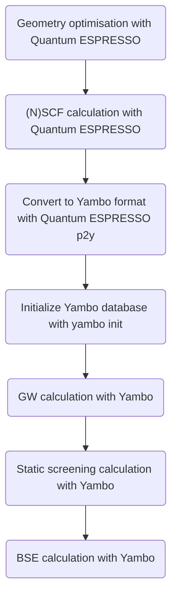

Flow chart ([made using this](https://mermaid.js.org/syntax/flowchart.html)) for performing a GW calculation:

```mermaid
flowchart TD
    id0(Geometry optimisation with Quantum ESPRESSO)
    id1("(N)SCF calculation with Quantum ESPRESSO")
    id2(Convert to Yambo format with Quantum ESPRESSO p2y)
    id3(Initialize Yambo database with yambo init)
    id5(GW calculation with Yambo)
    id6(Static screening calculation with Yambo)
    id7(BSE calculation with Yambo)
    id0 --> id1
    id1 --> id2
    id2 --> id3
    id3 --> id5
    id5 --> id6
    id6 --> id7

```